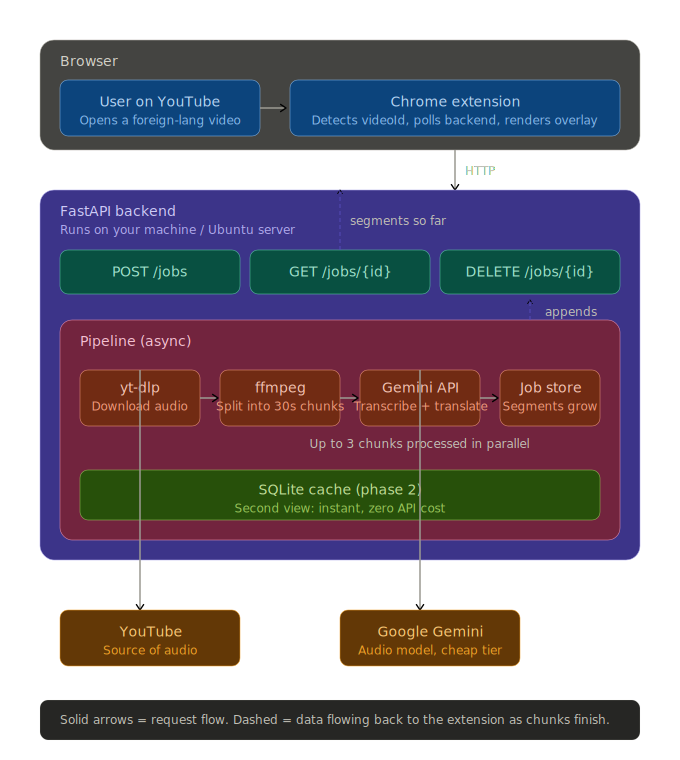
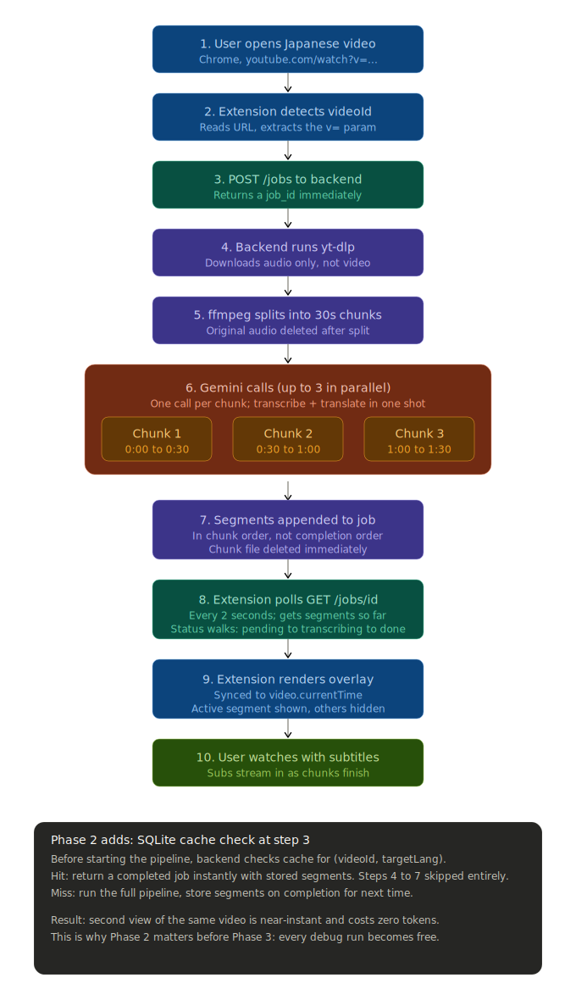

# CookedTranslate

CookedTranslate is an experimental YouTube translation project.

Current repository state:
- **Active code:** a Python/FastAPI backend (`backend/`) that processes YouTube audio in chunks, returns timestamped translated segments, and caches completed translations in SQLite so repeat views skip Gemini entirely.
- **Legacy prototypes:** early extension/API experiments are kept in `OLD/`.
- **Design docs/assets:** roadmap files and architecture/request-flow SVGs in the repo root.

**Roadmap progress:** Phase 0 (PoC), Phase 1 (end-to-end on Windows), and Phase 2 (caching) are done. Next up: Phase 3 (chunk-overlap to fix boundary garbling).

---

## What it does (today)

The backend provides an async job API:
- `POST /jobs` — create or reuse a translation job. Cache hits return a synthesized `done` job immediately with no Gemini call.
- `GET /jobs/{job_id}` — poll status/progress/segments
- `DELETE /jobs/{job_id}` — cancel job
- `GET /health` — liveness check

Pipeline flow (from `backend/pipeline.py`):
1. Download YouTube audio (`yt-dlp`)
2. Probe duration and split into chunks (default `30s`)
3. Transcribe + translate chunks via Gemini in parallel (default concurrency `3`)
4. Emit chunk results in-order so client-side playback remains stable
5. On success, persist the full segment list to the SQLite cache
6. Clean up temporary files

Job state is **in-memory only** (`backend/jobs.py`), so restart clears all in-flight jobs — but completed translations live in the on-disk cache and survive restarts.

### Caching (Phase 2)

`backend/cache.py` is an SQLite-backed cache keyed on `(video_id, target_lang, pipeline_version)`.

- **Cache lookup happens before job creation.** A hit returns a `done` job with the full segment array, so the second view of the same video is instant and spends zero Gemini tokens.
- **Pipeline version gate.** `PIPELINE_VERSION` in `cache.py` is bumped whenever something that affects translation output changes (prompt, model, chunk size, overlap rules). Old entries become unreachable and get evicted by LRU.
- **LRU eviction by total bytes.** When the on-disk size exceeds `CACHE_MAX_BYTES` (default 500 MB), the oldest-by-`last_accessed` entries are removed until under budget.
- **WAL mode.** Reads don't block writes; cache calls run via `asyncio.to_thread` so the event loop stays unblocked.

---

## Architecture & request flow diagrams

### Architecture



### Request flow



> Note: the diagrams predate Phase 2 and don't show the SQLite cache lookup that now precedes job creation.

---

## Repository structure

```text
.
├── backend/                       # Active FastAPI backend
│   ├── app.py                     # API entrypoint
│   ├── pipeline.py                # End-to-end async pipeline
│   ├── gemini_client.py           # Gemini integration
│   ├── audio.py                   # ffmpeg/ffprobe helpers
│   ├── ytdl.py                    # yt-dlp wrapper
│   ├── jobs.py                    # In-memory job registry
│   ├── cache.py                   # SQLite translation cache (Phase 2)
│   ├── schemas.py                 # Pydantic request/response models
│   ├── requirements.txt
│   └── README.md                  # Backend-focused usage notes
├── OLD/                           # Earlier prototypes and experiments
├── ROADMAP.md                     # Project roadmap
├── cookedtranslate_architecture.svg
└── cookedtranslate_request_flow.svg
```

---

## Backend setup

From `backend/`:

```bash
pip install -r requirements.txt
```

Set `GEMINI_API_KEY` either in the shell or in a `backend/.env` file (loaded automatically via `python-dotenv`):

```powershell
# PowerShell
$env:GEMINI_API_KEY = "your_key"
```

```bash
# bash
export GEMINI_API_KEY=your_key
```

Then run:

```bash
uvicorn app:app --reload --port 8000
```

Environment variables:
- `GEMINI_API_KEY` (required)
- `GEMINI_MODEL` (default: `gemini-flash-lite-latest`)
- `CHUNK_SECONDS` (default: `30`)
- `MAX_PARALLEL` (default: `3`)
- `CACHE_DB_PATH` (default: `./cookedtranslate.db`)
- `CACHE_MAX_BYTES` (default: `524288000`, i.e. 500 MB)

Dependencies (current): FastAPI, Uvicorn, Pydantic, google-genai, yt-dlp, python-dotenv. SQLite ships with Python — no extra install. `ffmpeg`/`ffprobe` must be available on `PATH`.

---

## Quick API usage

```bash
curl -X POST http://localhost:8000/jobs \
  -H "Content-Type: application/json" \
  -d '{"video_id":"w-u_NrA9owA","target_lang":"English"}'
```

Then poll:

```bash
curl http://localhost:8000/jobs/<job_id>
```

The first call runs the full pipeline. Subsequent calls for the same `(video_id, target_lang)` return `status: "done"` with the cached segments immediately.

---

## Important notes / current limits

- In-memory job registry: in-flight jobs vanish on restart (completed translations are cached on disk and survive)
- No cache-management HTTP endpoint yet — clear entries by deleting the SQLite file or bumping `PIPELINE_VERSION`
- No auth/rate limiting yet — anyone reaching the port can spend your Gemini tokens
- CORS is open (`*`) for development
- Chunk boundary garbling is not yet handled (Phase 3)

---

## Project status

Phases 0–2 are complete: the backend pipeline runs end-to-end on Windows with parallel chunk processing and a persistent SQLite translation cache. Phase 3 (chunk overlap to fix boundary garbling) is up next, followed by the extension rewrite. See `ROADMAP.md` for the full plan.
